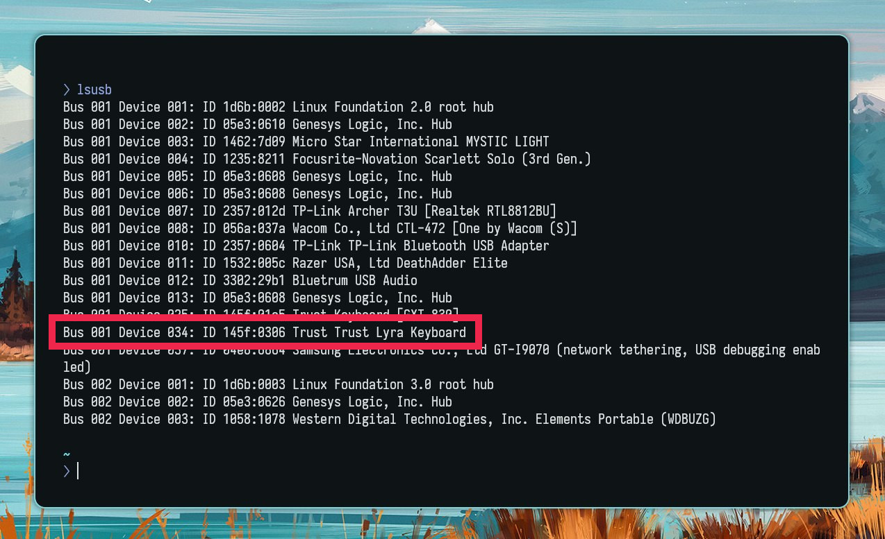

# ⌨️ keyboardfix

A pretty simple script i created for my own need to fix my keyboard.

## What does it do? What's the issue?

For some reason there's this strange issue in Hyprland (or maybe Wayland, idk, i only ever noticed this on Hyprland) where some devices' permissions get messed up and you'd have to unplug them and plug them back in to get them to work.

This happened to me using this shitty keyboard of mine, the [Trust Lyra Keyboard](https://asset.conrad.com/media10/isa/160267/c1/-/en/002813863PI04/image.jpg) which would not work by any means if i weren't to unplug the wireless receiver and plug it back in.

I solved this simply doing a manual reset of the authorization from the kernel to the usb device and put it in a systemd unit so that it gets executed after every resume.

## 📦 Installation

### 1️⃣ Step 

You'll have to pass to the script the number of your device, and you'll find that using `lsusb` (in case you don't have this command available just install `usbutils`).

Simply find your device and look for the number next to `Bus xxx Device`, removing any leading 0.

<details>
    <summary>📷 Click here to view an example.</summary>

     

    In my case the device number was 34. (remember to remove any leading 0)
</details>

### 2️⃣ Step

You can run the script in two ways.
- Fetch it with curl and pipe it to bash

```bash
curl -fsSL https://raw.githubusercontent.com/Xitonight/keyboardfix/main/install.sh | bash -s -- <your_device_number>
```

- Clone the repo locally and run it

```bash
git clone https://github.com/Xitonight/keyboardfix && cd keyboardfix
chmod +x ./install.sh
./install.sh <your_device_number>
```

## ❌ Uninstalling 

Run these commands

```bash
sudo rm /etc/systemd/system/reset-usb.service
sudo systemctl daemon-reload
```
